# hello_world

Name : Nafisa Chiquita Finandra Putri | NIM : 244107060020

A new Flutter project.

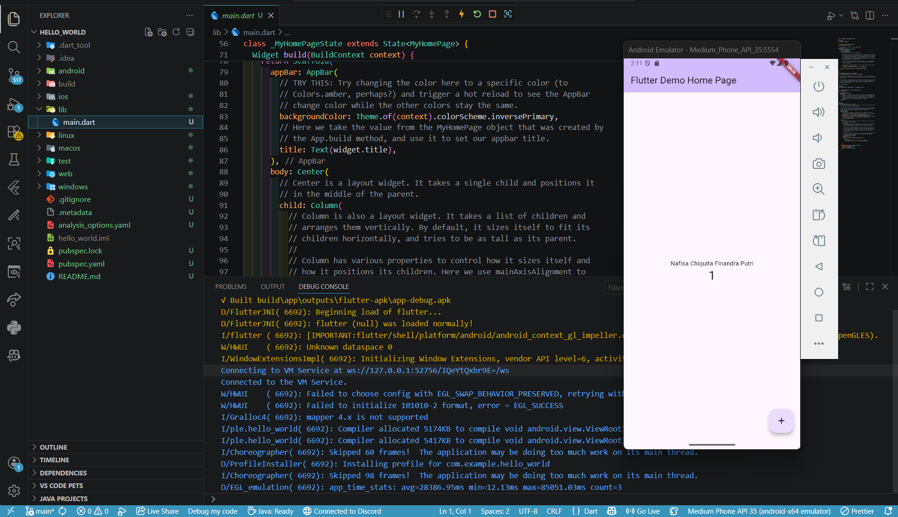 
1. This is the default display when we first run a Flutter debug. We can tap the button and the number will automatically increase
-------------------------------------------

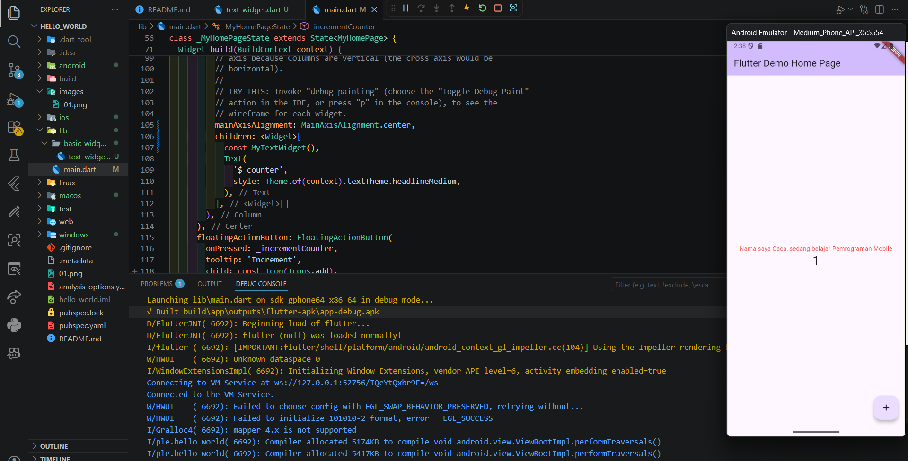
2. In this step, I modified the text and adjusted the text style to be red. The code represents a simple Flutter widget called MyTextWidget that uses StatelessWidget to display text on the screen
-------------------------------------------

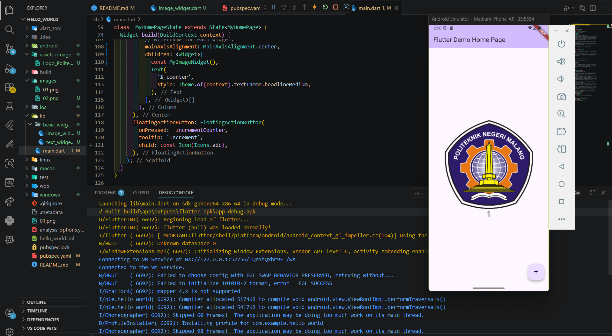
3. The code represents a Flutter widget called MyImageWidget used to display an image using StatelessWidget. The image is loaded from a local asset using AssetImage, specifically the file Logo_Politeknik_Negeri_Malang.png. This widget displays a static image without any state changes
-------------------------------------------

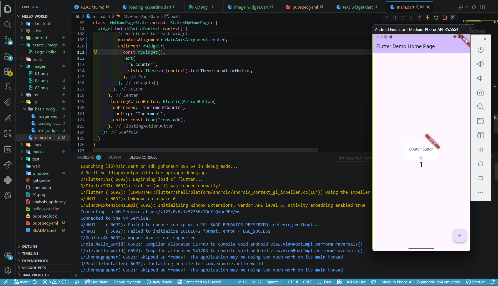
4. This code uses Cupertino-style widgets to display components with an iOS-like appearance. It demonstrates that Flutter supports building user interfaces with iOS design in addition to Material Design
-------------------------------------------

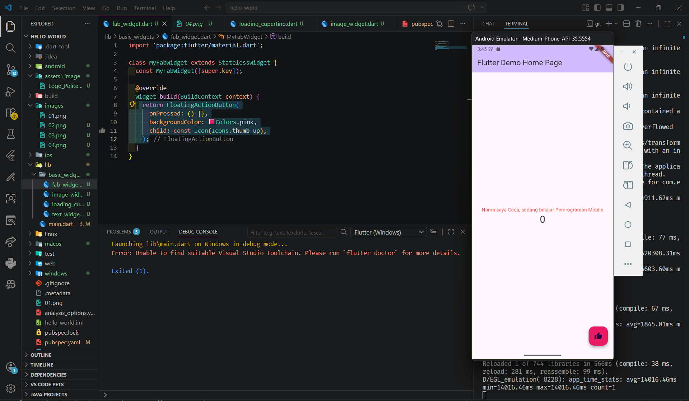
5. This code adds a FloatingActionButton to the Flutter application within a Scaffold. The button uses a thumb_up icon and has a pink background color. The onPressed property is used to define the action when the button is pressed
-------------------------------------------

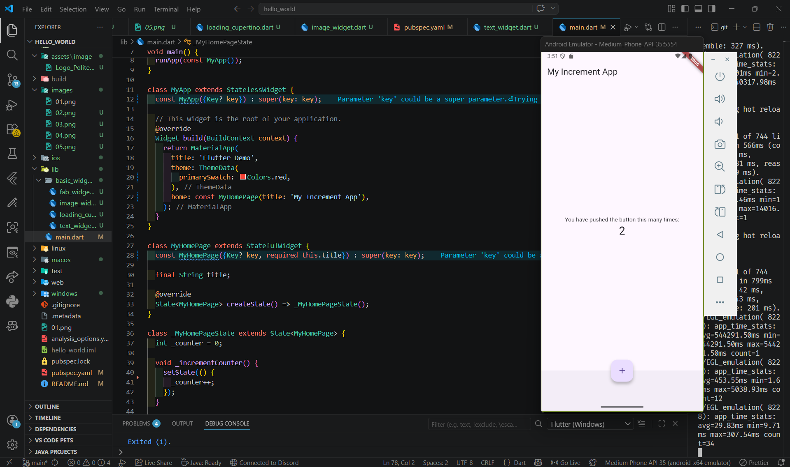
6. Kode tersebut merupakan aplikasi Flutter This code represents a simple Flutter application using StatefulWidget to implement a counter feature. The _counter value increases each time the FloatingActionButton is pressed through the _incrementCounter() function, which uses setState to update the UI automatically. The interface includes an AppBar for the title, a Column to display text and the counter value at the center, and a BottomAppBar at the bottom. The button position is set using floatingActionButtonLocation: centerDocked, placing it at the bottom center of the screen
-------------------------------------------

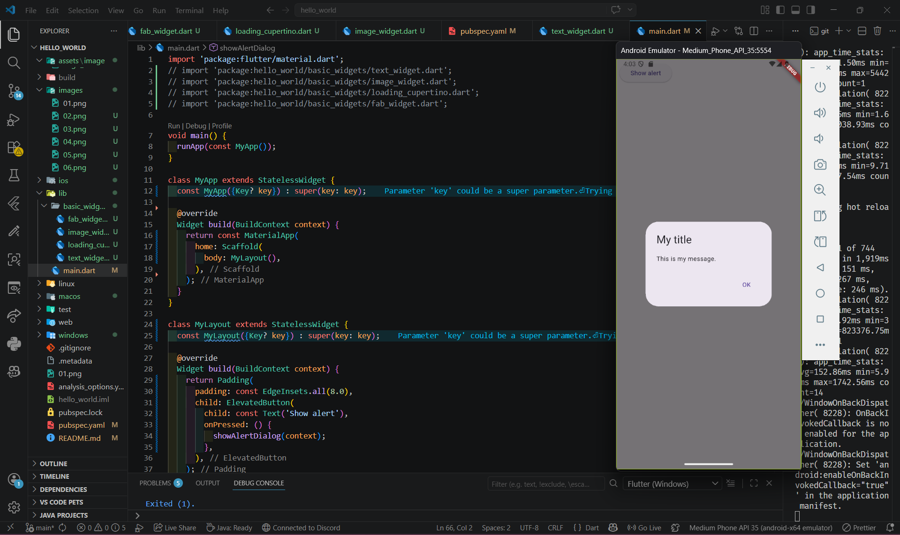
7. This code represents a simple Flutter application that displays a “Show alert” button using ElevatedButton. When pressed, it calls the showAlertDialog function, which displays an AlertDialog containing a title, message, and an “OK” button. The “OK” button closes the dialog using Navigator.pop(context)
-------------------------------------------

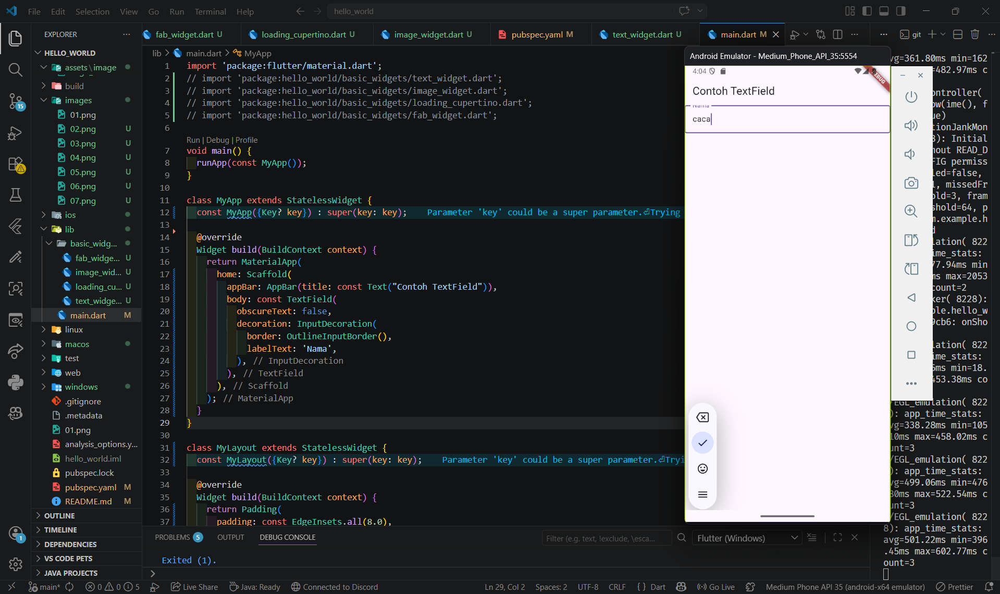
8. This code displays an input form using the TextField widget in Flutter. The TextField is used to receive user input with the label “Nama” and is styled with an outline border using OutlineInputBorder. The obscureText: false property indicates that the input text is visible (not hidden). The interface also includes an AppBar as the page title
-------------------------------------------

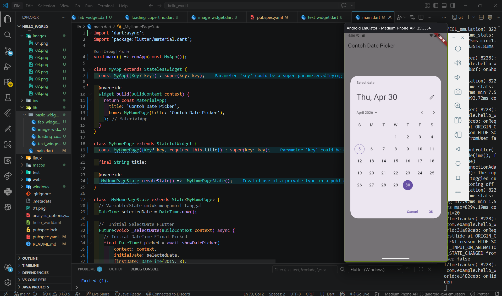
9. This code represents a Flutter application that implements a Date Picker feature for selecting a date. The selected date is stored in the selectedDate variable and updated using setState when a new date is chosen through the showDatePicker function. The interface displays the selected date along with a “Pilih Tanggal” button to open the date picker dialog. Additionally, the selected date value is printed to the console when the button is pressed
-------------------------------------------

Selesaikan Praktikum 2 dan Anda wajib menjalankan aplikasi hello_world pada perangkat fisik (device Android/iOS) agar Anda mempunyai pengalaman untuk menghubungkan ke perangkat fisik. Capture hasil aplikasi di perangkat, lalu buatlah laporan praktikum pada file README.md

  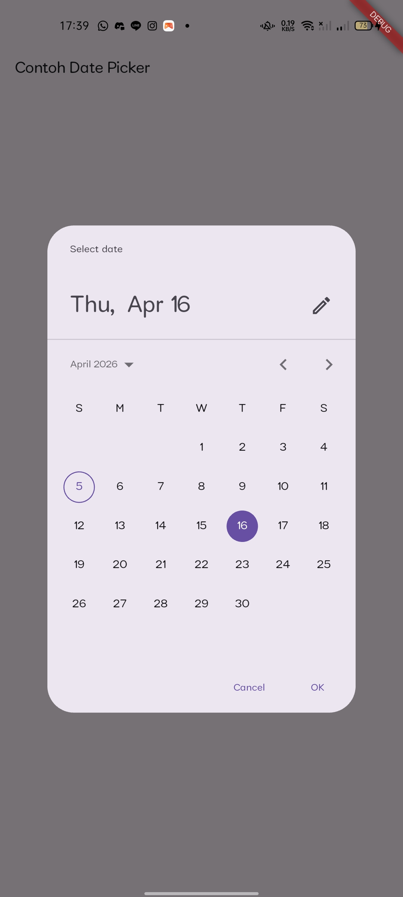
  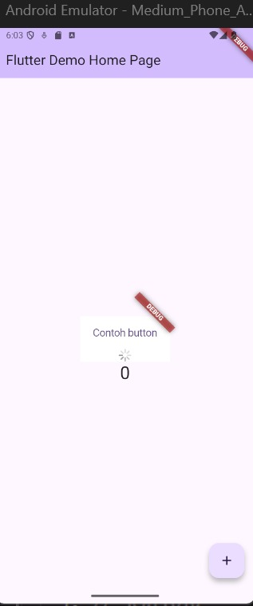
  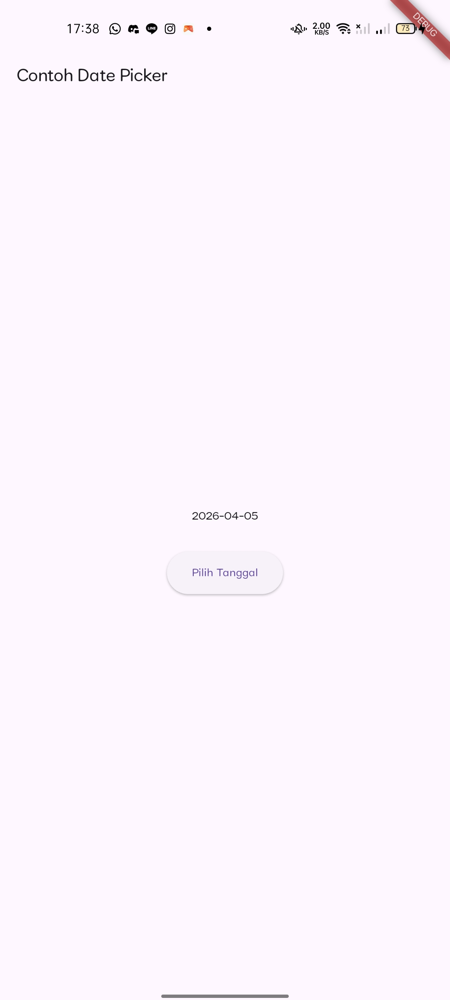

