# namer_app

Name : Nafisa Chiquita Finandra Putri | NIM : 244107060020

A new Flutter project.

In this section, I will explain several screenshots of the results from the code I have created. However, the complete proof of the project has been included in the **images** folder

1. 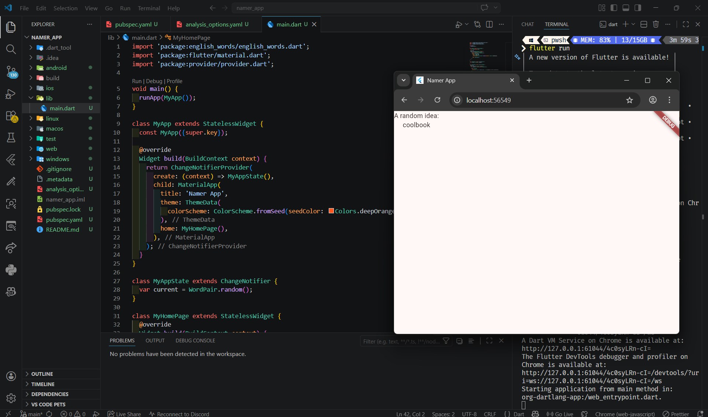
The code represents a simple Flutter application that displays a random word using the english_words package. The data is stored in MyAppState and accessed through Provider using context.watch, allowing the UI to automatically update when the data changes. The interface is built using Scaffold and Column, containing a title text and a randomly generated word in lowercase

2. 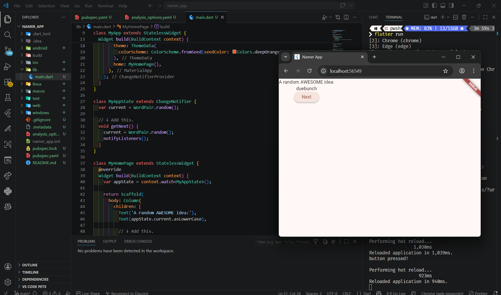
This code adds a “Next” button using the ElevatedButton widget. The button contains the text “Next” and includes an onPressed function that is triggered when clicked. At this stage, the button only prints “button pressed!” to the console and does not yet modify the data or UI

3. 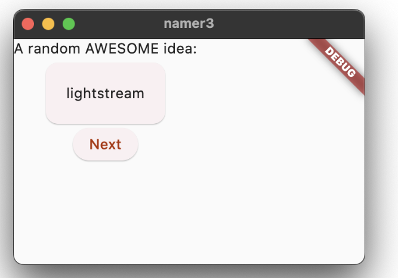
This code creates a new widget called BigCard, which is used to display a word pair (WordPair) inside a Card with padding

4. 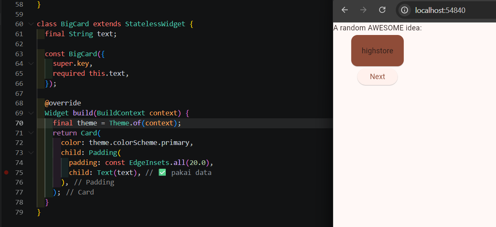
This code customizes the button’s appearance by changing its background color to red using the style property of ElevatedButton

5. 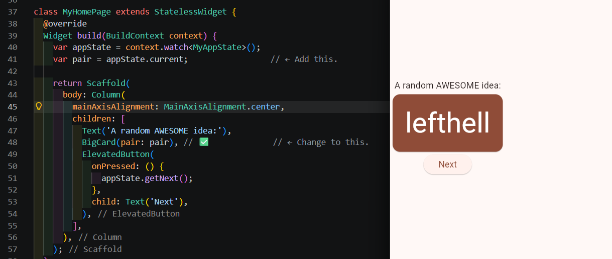
This code adds the property mainAxisAlignment: MainAxisAlignment.center to the Column widget to vertically center all elements, making the layout more organized instead of being aligned at the top.

6. 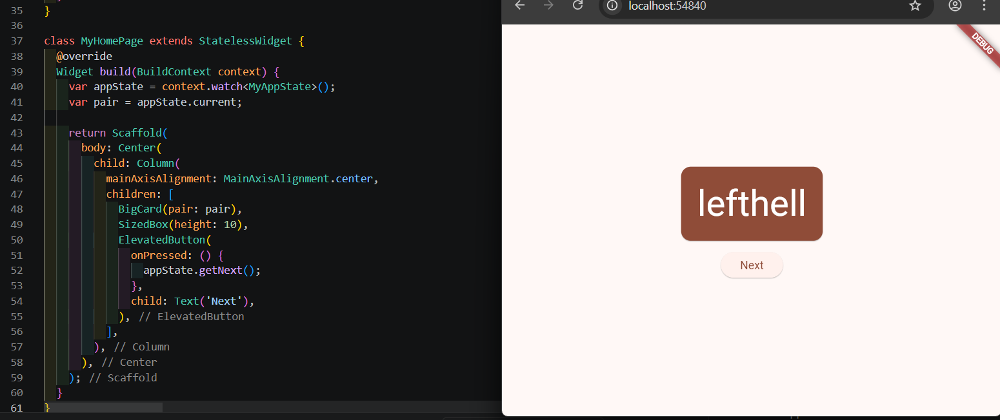
This step removes the Text widget above the BigCard

7. 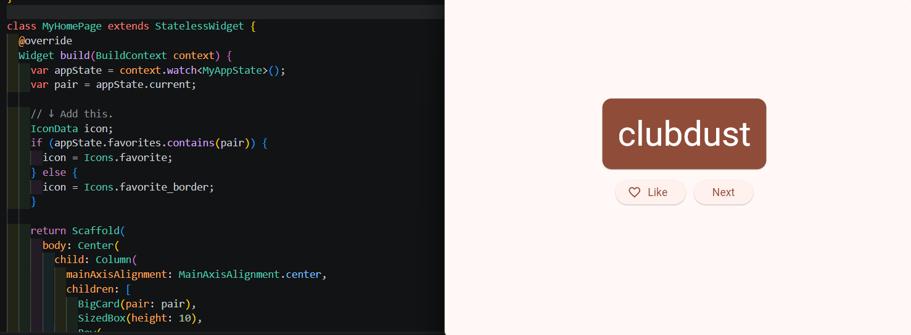
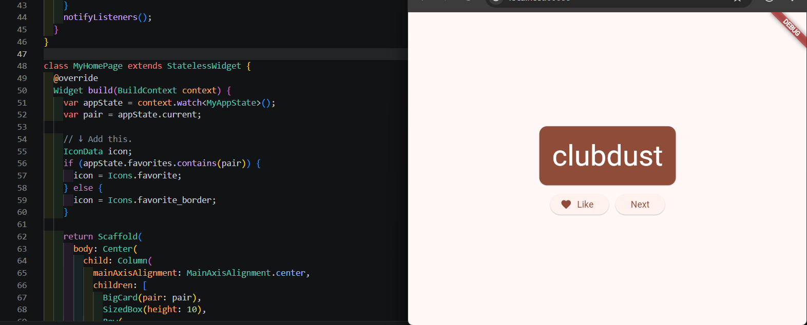
This code adds a “Like” button feature using ElevatedButton.icon, which includes both an icon and text. The icon dynamically changes between favorite and favorite_border depending on whether the current word is already in the favorites list

8. 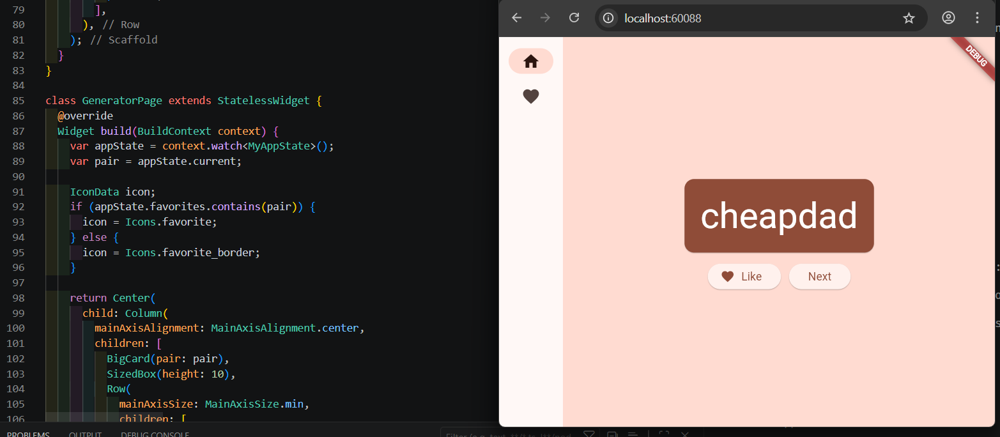
This code introduces navigation using NavigationRail with two menu options: Home and Favorites. The selectedIndex variable stores the currently selected menu and is updated using setState when the user selects a different option

9. 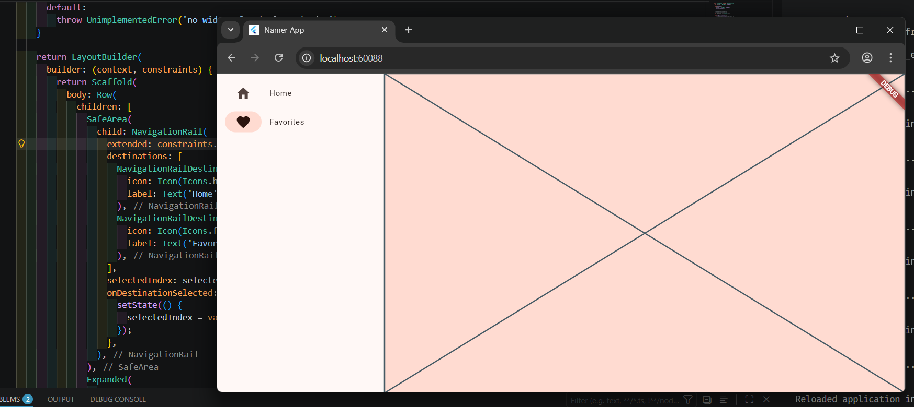
This code enhances navigation by displaying different pages based on the selectedIndex value using a switch statement. It also uses LayoutBuilder to create a responsive layout, where the extended property of NavigationRail automatically becomes true when the screen width is greater than or equal to 600, showing labels next to the icons

10. 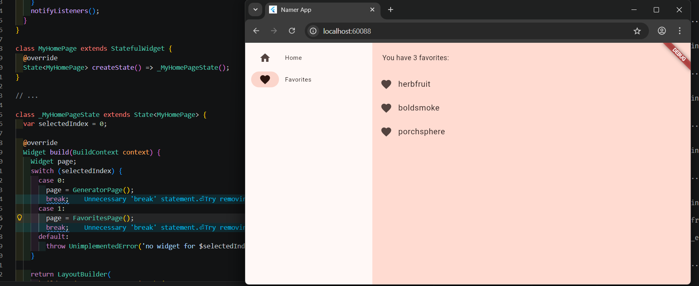
This code creates a FavoritesPage that displays a list of liked (favorite) words. The data is retrieved from MyAppState. If the favorites list is empty, it shows the message “No favorites yet.” Otherwise, it displays a list (ListView) containing the total number of favorites and each liked word as a ListTile with a heart icon