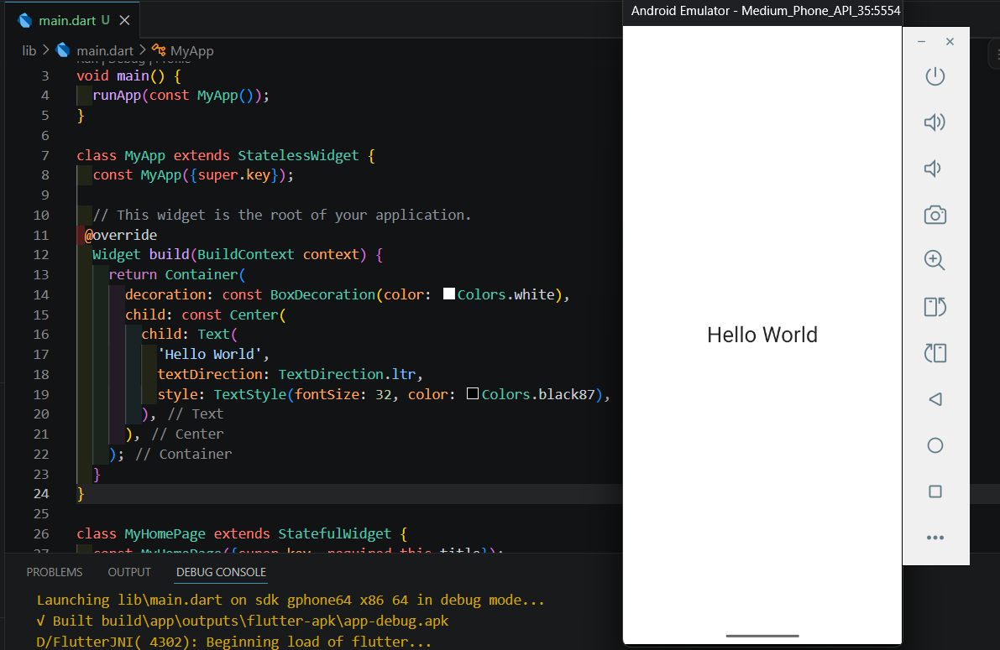
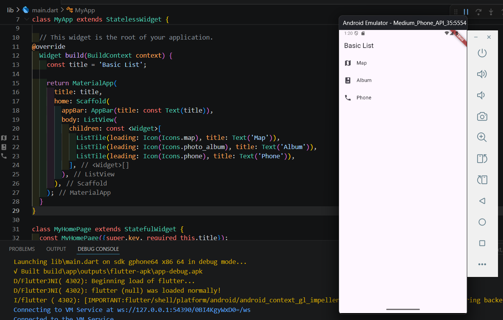
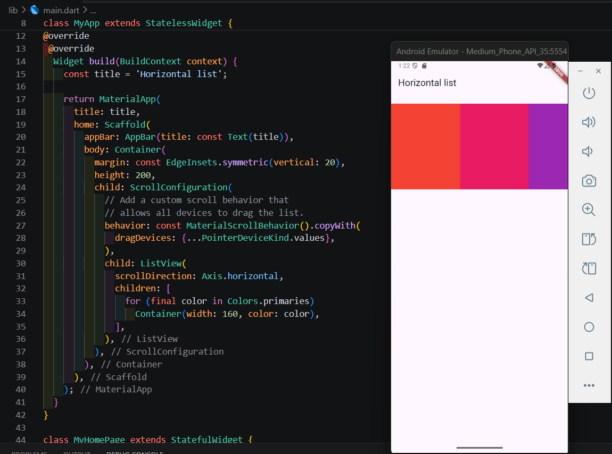
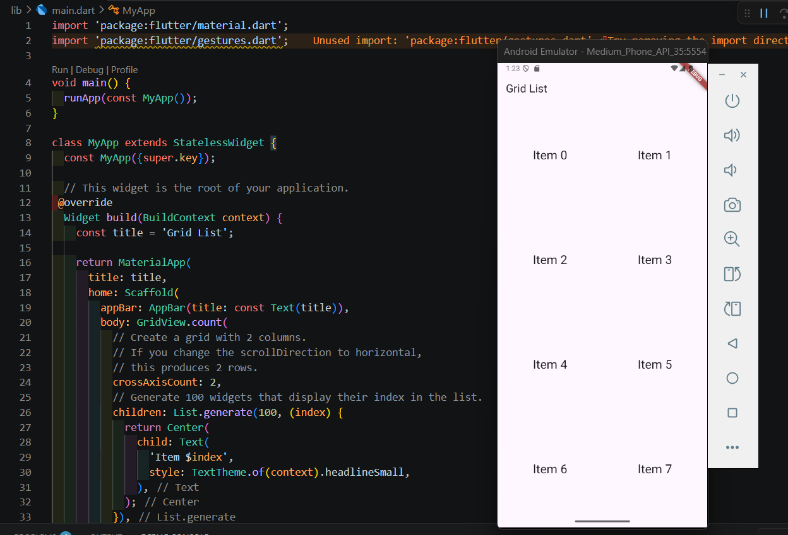
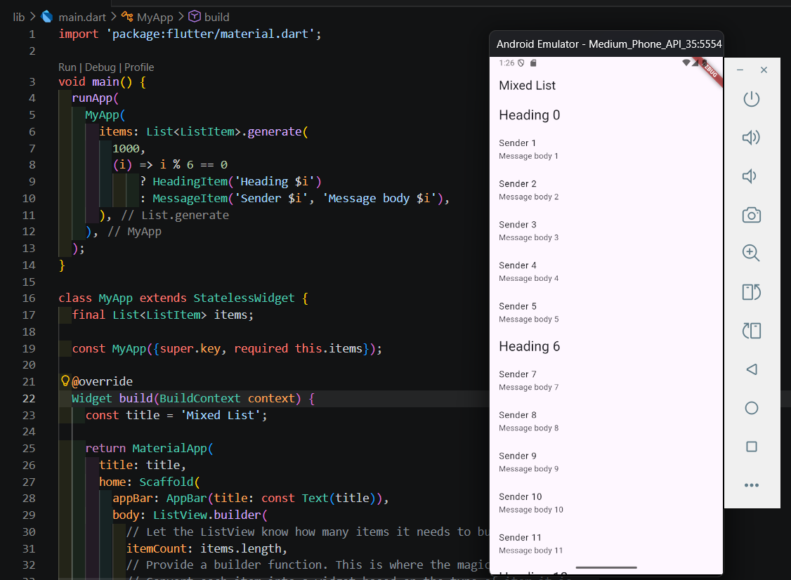
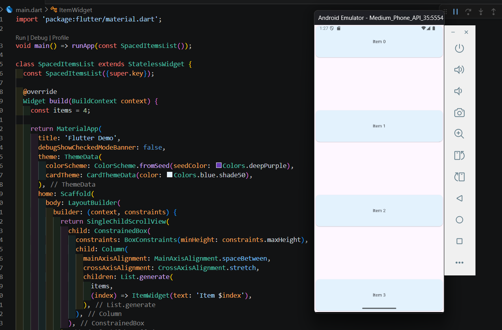
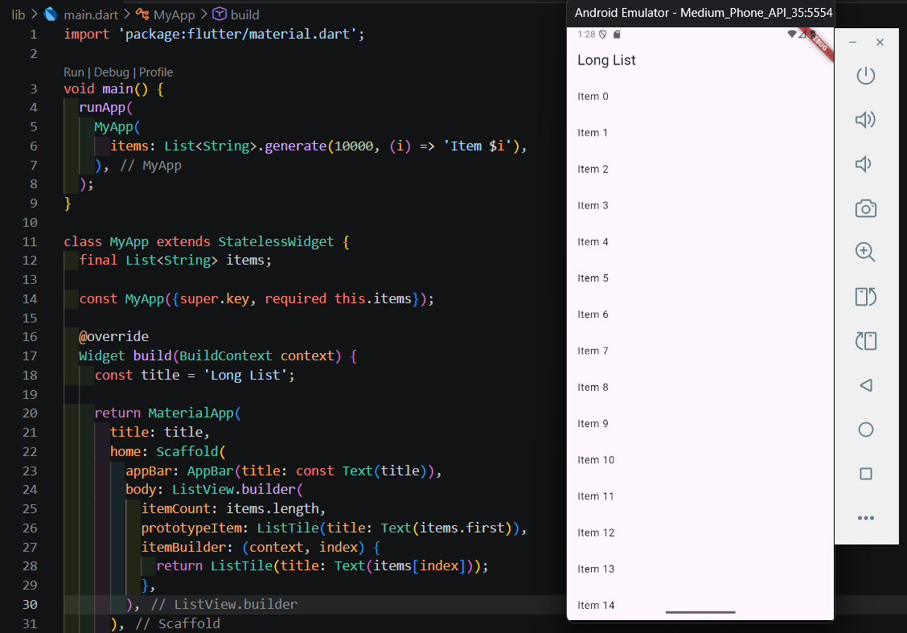
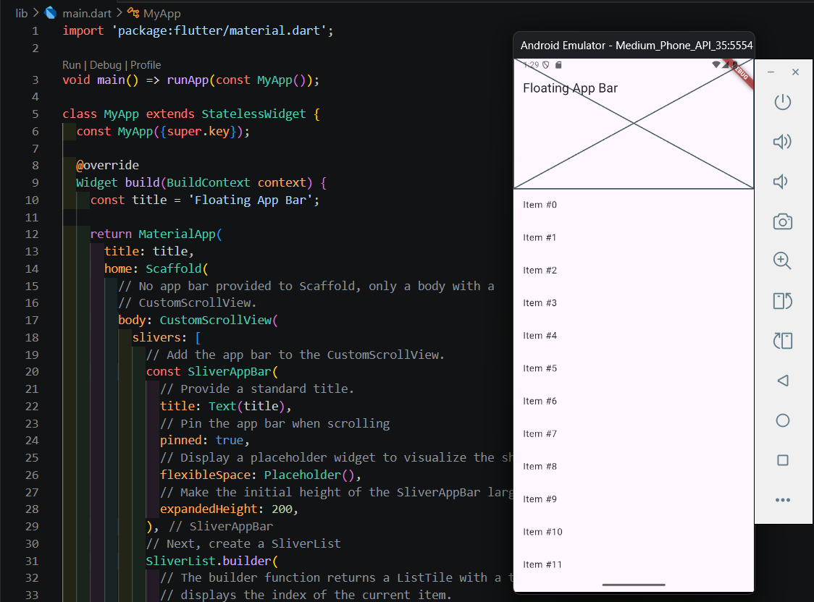
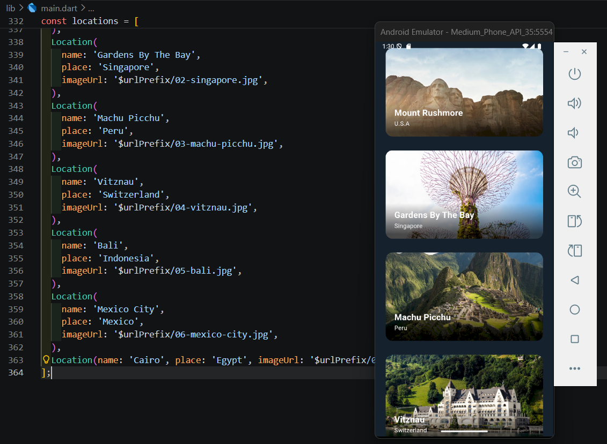

# basic_layout_flutter

Name : Nafisa Chiquita Finandra Putri | NIM : 244107060020

**Project Layout Flutter**

This code uses a combination of the Container, Center, and Text widgets to display a message in the center of the screen. Based on the display in the Android Emulator, the app compiled and ran successfully with a layout that matches the definition in the main dart file

 

The provided Dart code demonstrates a fundamental implementation of a ListView widget within a Flutter application. The MyApp class defines a StatelessWidget that sets up a MaterialApp with a Scaffold. The core of the UI is a ListView containing three ListTile widgets, each configured with a leading icon (Map, Album, and Phone) and a corresponding text label. This structure follows a clean and declarative approach to building linear, scrollable lists in Flutter

 

Tentu, ini adalah deskripsi dalam bentuk paragraf yang lebih mengalir untuk laporanmu:

This code implements a horizontal scrolling list in Flutter using a ListView widget configured with Axis.horizontal. The list dynamically renders a series of colored containers by iterating through the Colors.primaries list, with each item set to a fixed width of 160 pixels. To ensure a seamless user experience across different platforms, the implementation includes a custom ScrollConfiguration that enables drag-to-scroll functionality for all pointer devices, including mice. The entire list is housed within a fixed-height Container and wrapped in a standard MaterialApp and Scaffold structure, providing a clean and responsive layout for displaying horizontal content

 

 

Code from image 04 and 05 demonstrates the implementation of a two-column grid layout in Flutter using the GridView.count widget. By setting the crossAxisCount to 2, the application organizes its content into a vertical grid that automatically handles item positioning. The grid is populated with 100 items generated dynamically using List.generate, where each item displays its index labeled as "Item $index" centered within the grid cell. This layout utilizes the standard MaterialApp and Scaffold structure, providing a clean and scalable way to display large sets of data in a structured grid format

 

This code illustrates how to create a spaced-out vertical layout that remains responsive using a combination of LayoutBuilder and ConstrainedBox. By utilizing MainAxisAlignment.spaceBetween within a Column, the application evenly distributes a set of items across the full height of the screen. The implementation ensures that the content can adapt to various screen sizes while maintaining a scrollable view via SingleChildScrollView if the content exceeds the viewport. Additionally, it features a customized ThemeData with a light blue CardTheme, giving the dynamically generated item widgets a consistent and clean aesthetic

 

 

The final code defines a data model and a list of objects used to populate a location-based travel UI in Flutter. It utilizes a custom Location class to store structured data, including the destination name, geographical place, and a specific image URL for each entry. The accompanying emulator screenshot shows these objects being rendered into a visually rich list of cards, where each card features a background image with overlaid text, showcasing a clean and modern way to handle dynamic content mapping within a mobile application
