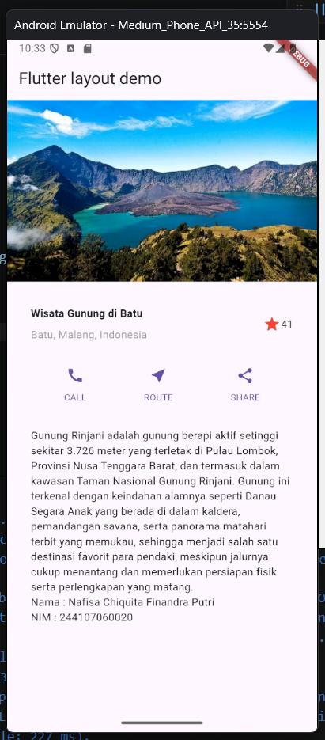
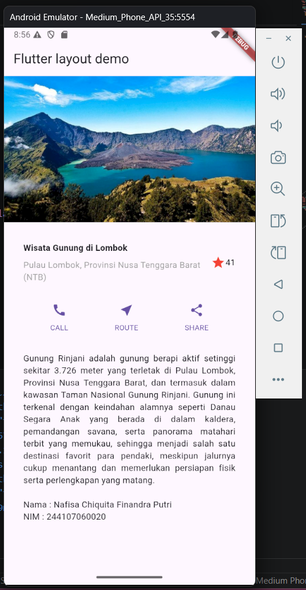
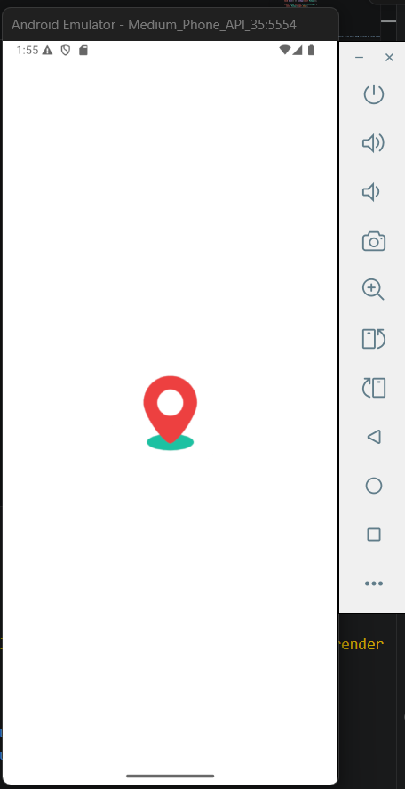

Name : Nafisa Chiquita Finandra Putri | NIM : 244107060020

**Project Maps**

In this first image, I have followed the steps from the practicum. I chose Mount Rinjani as the tourist destination. However, the text layout is still messy and not yet properly arranged

In the second image, I have improved and organized the text layout so that the overall appearance looks neater

In the third image, I changed the app icon from the default Flutter icon to a maps icon to make it more relevant to the application

