# shopping

Name : Nafisa Chiquita Finandra Putri | NIM : 244107060020

**Project Mini Marketplace**
Here I will list the main code used to build this application :

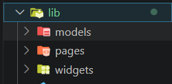 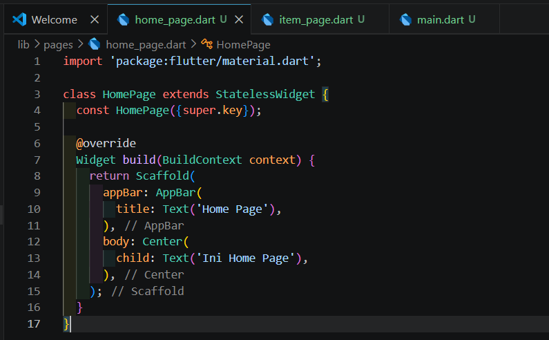 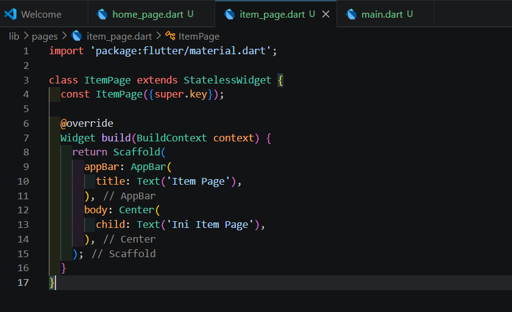 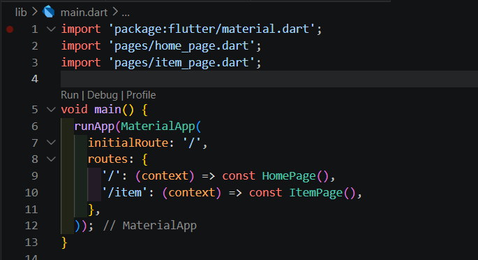 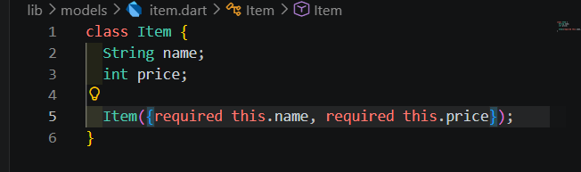 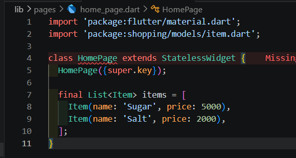 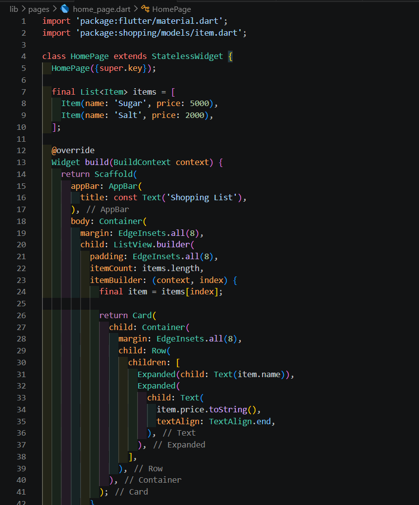 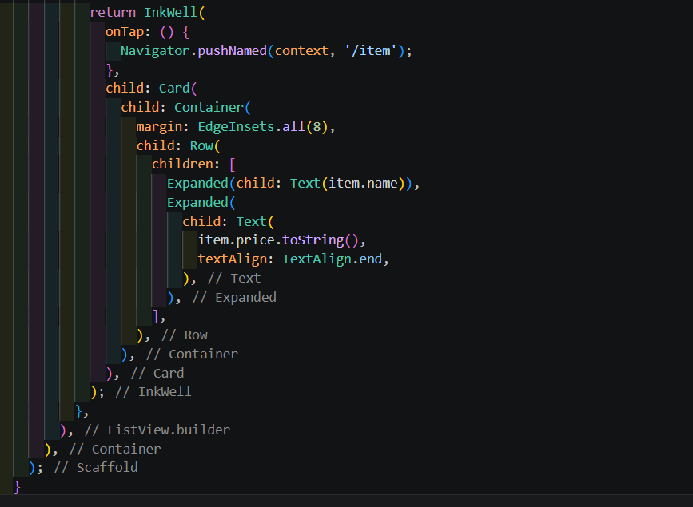 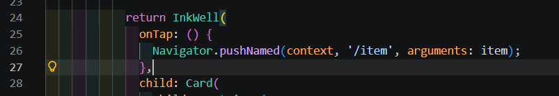 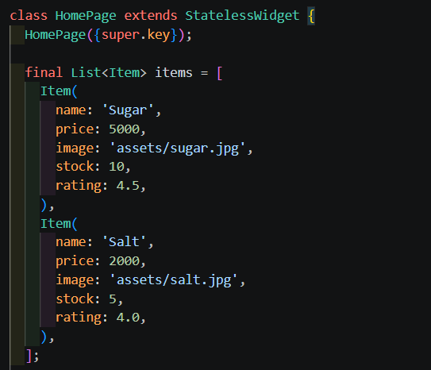 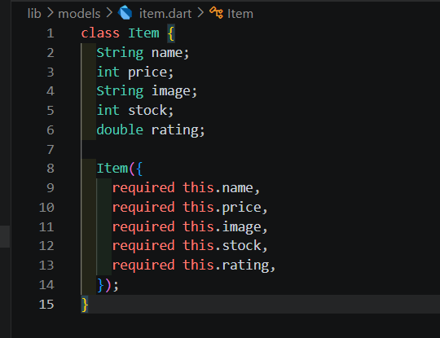 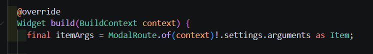 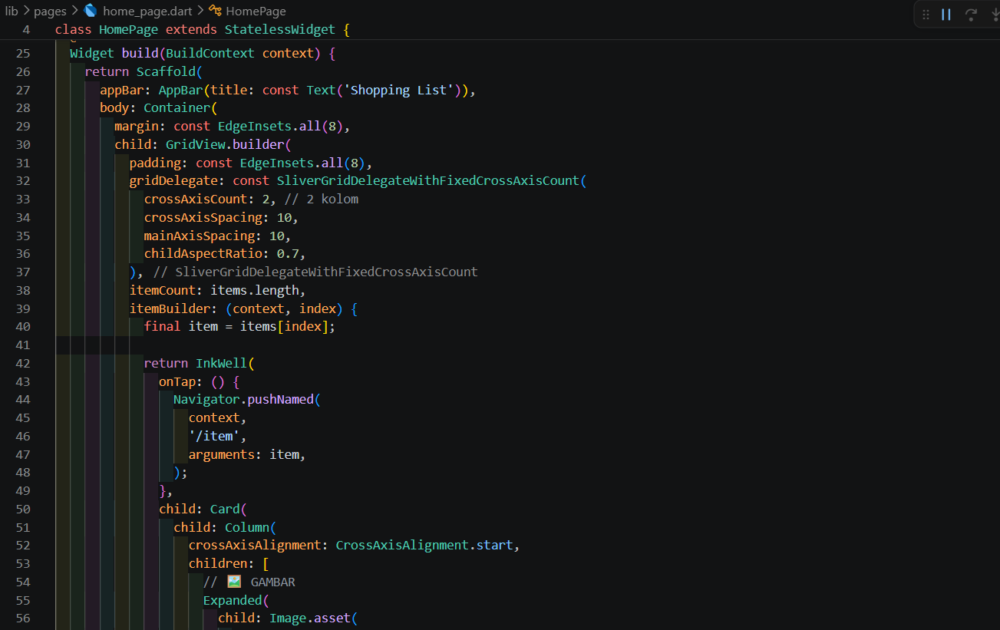 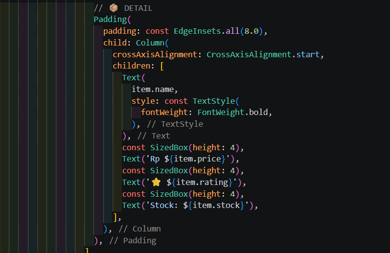

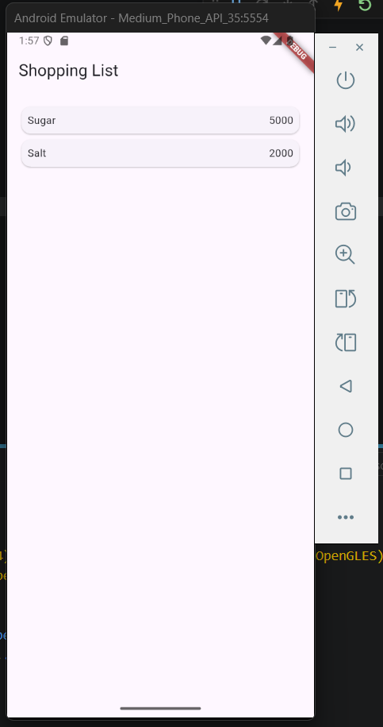

Figure 08 will display a simple list of the items for sale; this widget does not yet use navigation, so nothing will happen if you click it

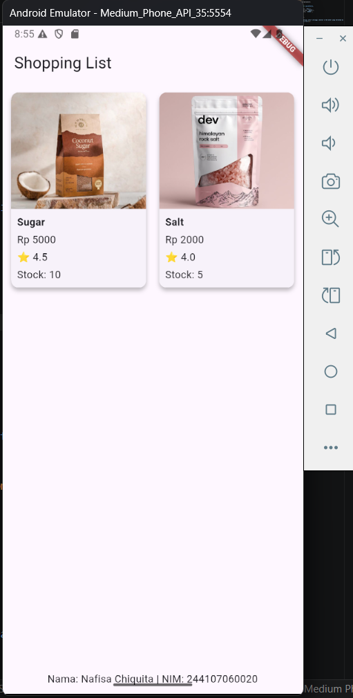

This output features a Shopping List interface implemented in Flutter, displaying a catalog of products in a clean, grid-based layout. Each item is presented within a Card widget that includes a high-quality product image, followed by essential details such as the product name, price in Rupiah, a star rating, and the available stock. The design utilizes a light-themed Scaffold with a prominent "Shopping List" title at the top and a custom footer at the bottom for student identification, showcasing an effective use of layout widgets and custom styling to create a functional e-commerce display

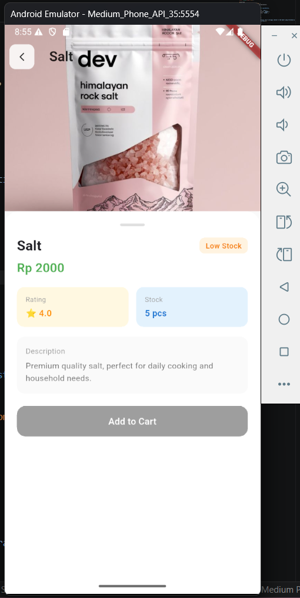 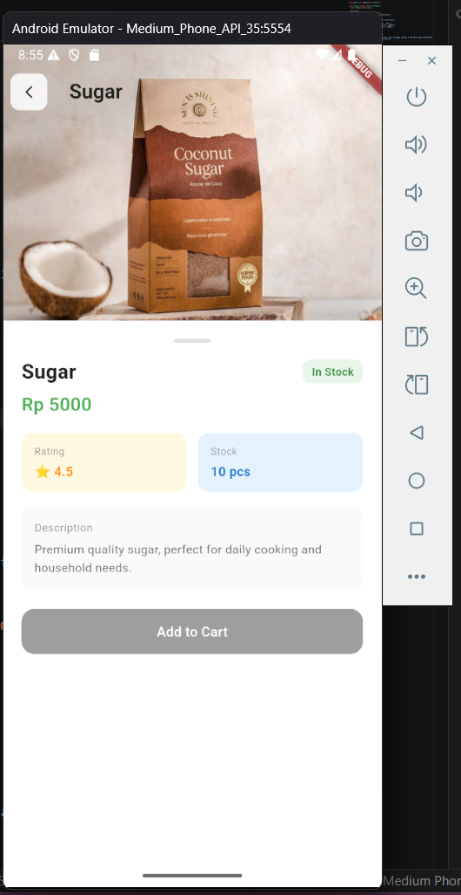

Here, I’ve made some adjustments to create a more visually appealing UI for the product details, such as adding a widget to wrap the elements inside

This output presents a Product Detail Page in the application, providing a comprehensive view of a specific item. The interface features a large product image at the top with a back navigation button for seamless user flow. Below the image, a bottom sheet-style layout displays organized information, including the product name, an "In Stock" badge, and the price. Data is further structured into designated cards for rating and stock quantity, followed by a text description and a prominent "Add to Cart" button. This design demonstrates the effective use of stacking widgets and varied container styles to create a professional and user-friendly mobile commerce experience

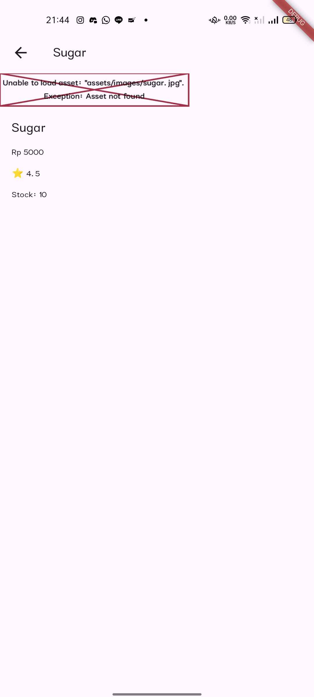 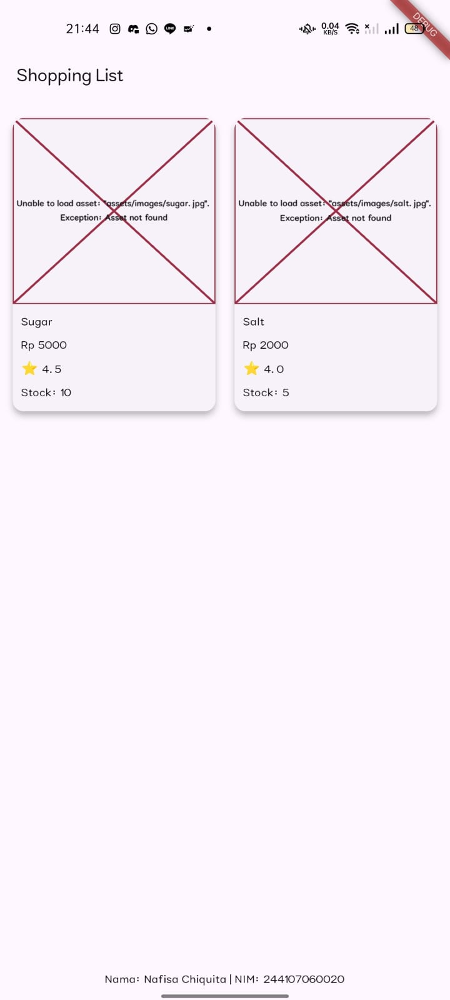

It can be compared to how it looked before I made the code fixes and UI improvements; in fact, the images weren’t loading properly at all, so they couldn’t be displayed

